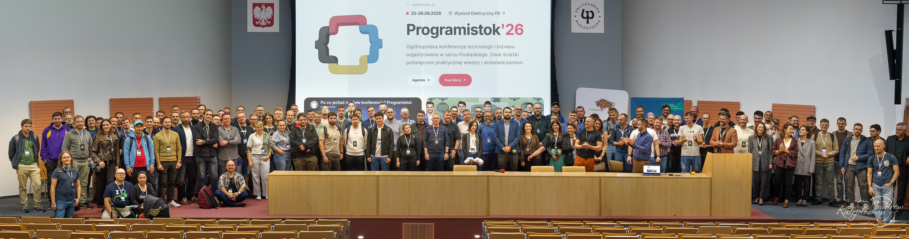
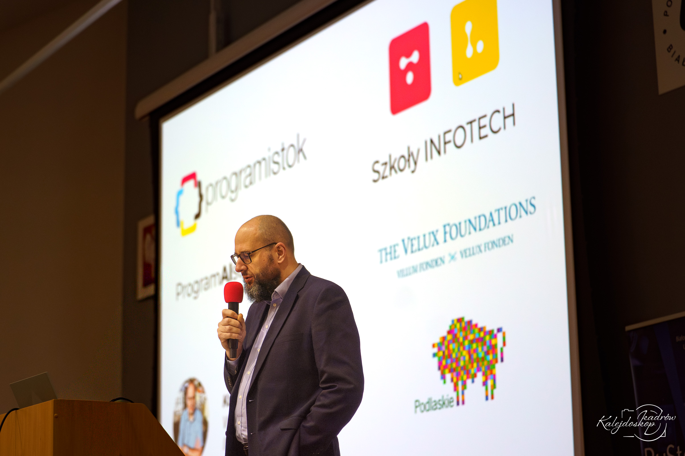
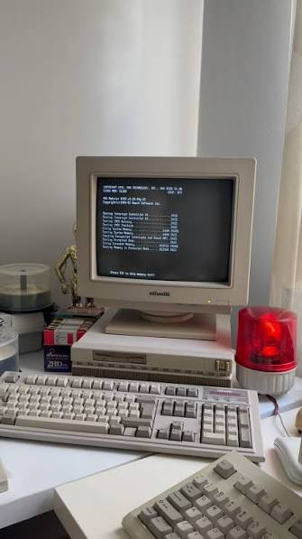
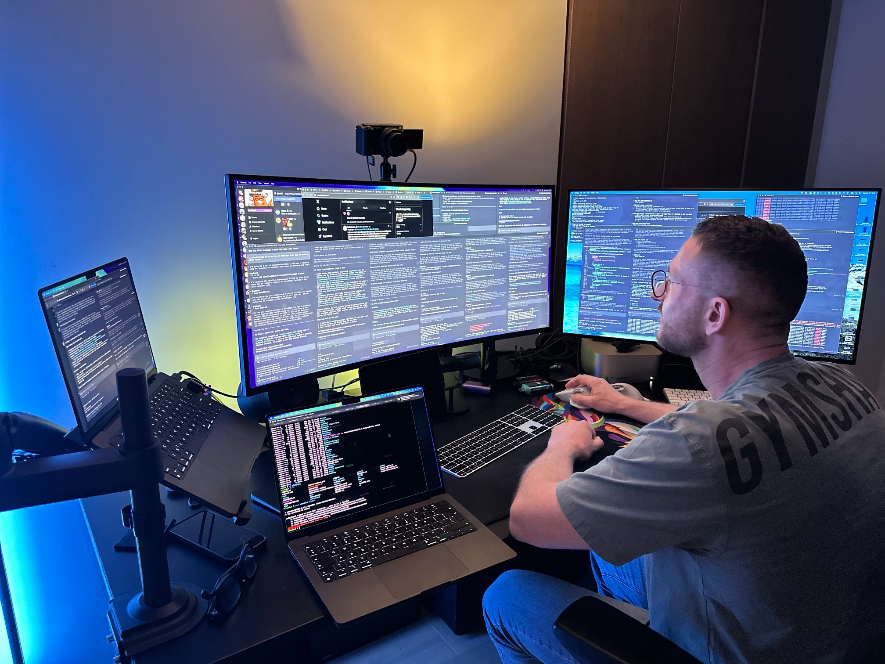
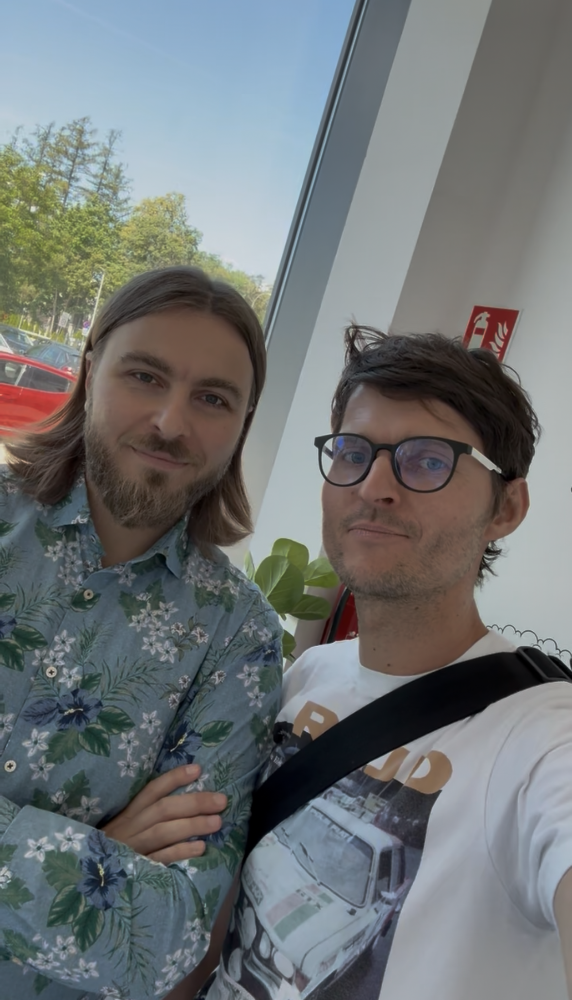
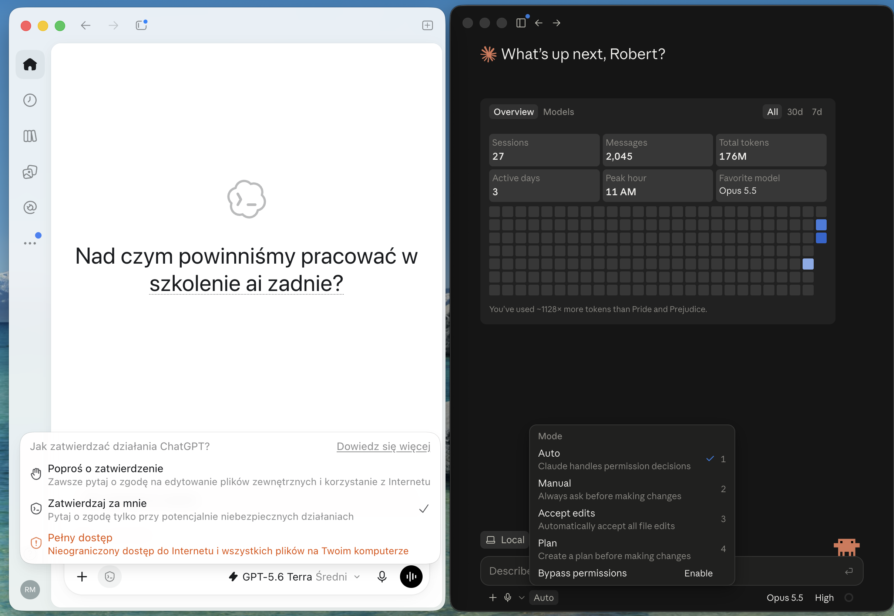
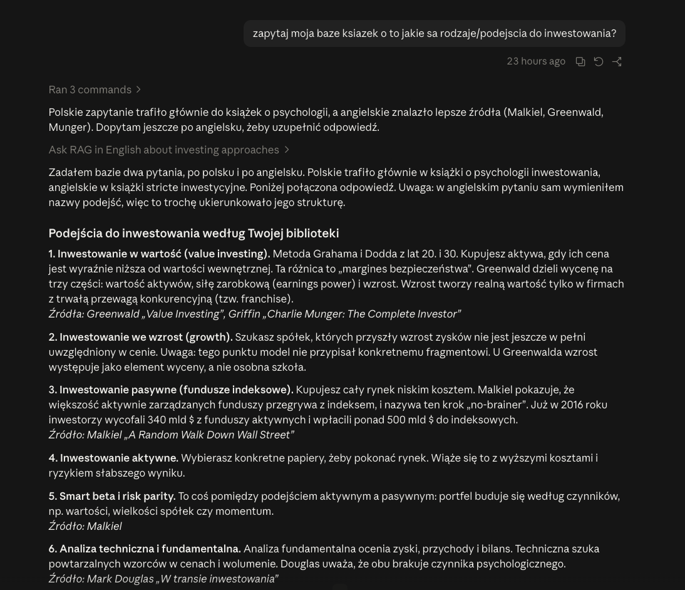
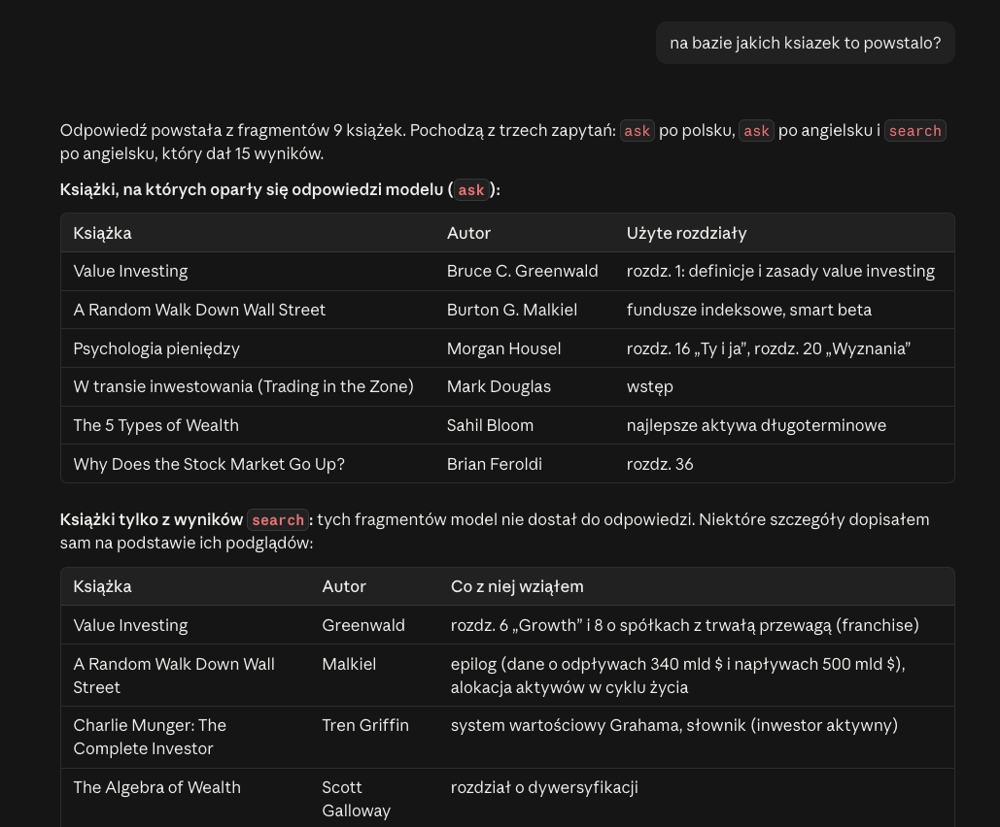
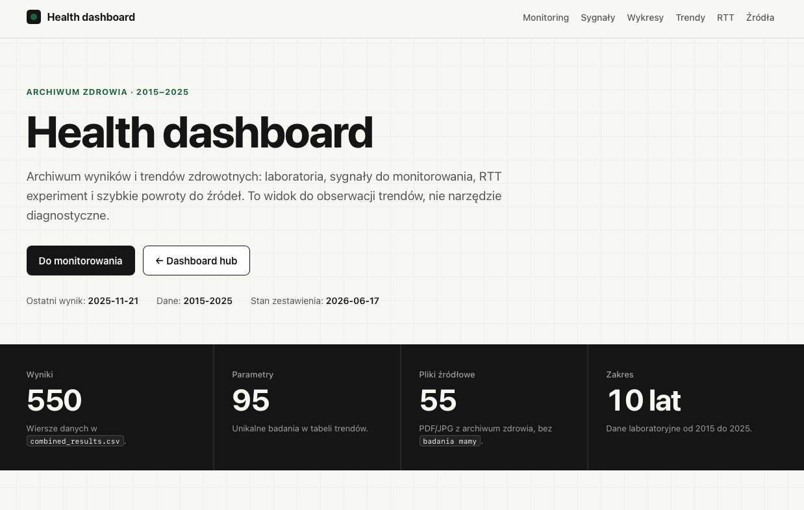
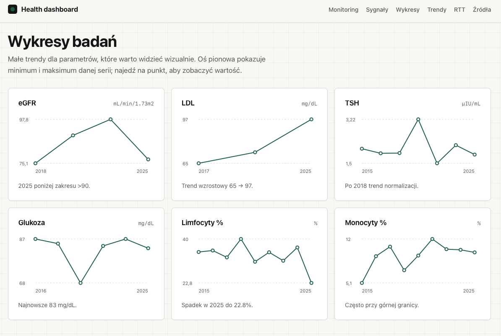

# AI dla menadżerów — od czatu do agenta AI

**Jak tworzyć i rozwijać agentów AI z użyciem OpenAI Codex lub Claude Code**

Robert Matyszewski · BPNT, Białystok · szkolenie 2 godziny: teoria, pokaz na żywo i krótkie ćwiczenie

---

## Spis treści

0. [Wstęp](#0-wstęp)
1. [Od czatu do agenta](#1-od-czatu-do-agenta)
2. [Czym jest agent — z czego się składa](#2-czym-jest-agent--z-czego-się-składa)
3. [Agent a software](#3-agent-a-software)
4. [Z czego składa się agent — przykłady](#4-z-czego-składa-się-agent--przykłady)
5. [Obsługa aplikacji](#5-obsługa-aplikacji)
6. [Tips and tricks: jak prowadzić pracę z agentem](#6-tips-and-tricks-jak-prowadzić-pracę-z-agentem)
7. [Od polecenia do skilla i automatyzacji](#7-od-polecenia-do-skilla-i-automatyzacji)
8. [Przykłady zaawansowane](#8-przykłady-zaawansowane)
9. [Pokaz na żywo i ćwiczenie](#9-pokaz-na-żywo-i-ćwiczenie)
10. [Zakończenie](#10-zakończenie)

**Myśl przewodnia:** Agent = model + cel + kontekst (pliki) + narzędzia zewnętrzne. Czat odpowiada, agent wykonuje pracę. Człowiek wyznacza cel, dostarcza kontekst i kontroluje wynik.

---

## 0. Wstęp

### 1. O mnie

**Robert Matyszewski**

- w branży IT od 2012 roku, na styku technologii, produktu, sprzedaży i biznesu
- LemonTea: zbudowałem agencję, sprzedana w 2016 roku
- kierowałem sprzedażą i marketingiem w SoftwareHut i TenderHut
- pracowałem w Netguru i YourNextStore
- tworzyłem GraphQL Editor, używany przez dziesiątki tysięcy osób
- budowałem TeamFinder: sieć zespołów IT na potrzeby klientów
- współorganizator Programistoku od 10 lat
- dziś buduję własne rozwiązania z AI i pomagam budować prototypy
- **jestem menedżerem, nie programistą**


### 2. Programistok 2026

**Programistok 2026** · 25–26.09.2026 · Wydział Elektryczny Politechniki Białostockiej

**Zapraszam na Programistok 2027!** Wrzesień 2027, Wydział Elektryczny PB · programistok.org



### 3. „Nie dałbym rady bez Klaudiusza”

> „Wiecie co, miałem tyle pism oficjalnych do napisania, że nie dałbym rady bez Klaudiusza.”
> — Karol Przybyszewski, organizator Programistoku, dyrektor liceum programistycznego INFOTECH

**Karol Przybyszewski**

- formalny organizator Programistoku: odpowiada za wszystkie dokumenty i współpracę z partnerami, m.in. z Politechniką Białostocką i Urzędem Marszałkowskim
- kiedyś programista i przedsiębiorca, dziś menedżer IT i dyrektor liceum programistycznego INFOTECH

Rozmowa odbyła się w trakcie konferencji Programistok. „Klaudiusz” to potoczna nazwa pracy z Claude jako agentem (Claude Code albo Claude Cowork). O tym jest to szkolenie.



### 4. Początki Claude Code

**Claude Code = model językowy + terminal**

Dowolna operacja na komputerze z użyciem języka człowieka. Prosty · bardzo szybki · ogromne możliwości.

**Dlaczego był atrakcyjny:** bezpośredni zakup usługi modeli językowych od największego dostawcy.

**Oś czasu:**

- 2025: wewnętrzne narzędzie Anthropic zostaje udostępnione publicznie
- chwilę później: pojawia się Codex (OpenAI)
- Programistok 2025: praca z agentami to temat każdej prezentacji
- koniec 2025: Claude Code bardzo popularny w branży IT


### 5. Terminal: powrót do komputera tekstowego

**Kiedyś:** MS-DOS, czyli komputer obsługiwany wyłącznie tekstem. Wpisywało się polecenia, nie klikało.

**Dziś:** przez terminal mówimy do komputera ludzkim językiem, a agent AI tłumaczy to na komendy i sam je wykonuje.



### 6. OpenClaw agentic engineering: jak pracował Peter

Kilkanaście okien terminala, jedno duże oprogramowanie. Proces powstawania opisany na blogu.

*„Trochę jak zarządzanie ludźmi.”*

Peter Steinberger to twórca OpenClaw, autonomicznego agenta AI, po którym został zatrudniony przez OpenAI.



### 7. Dlaczego tu jestem

**Chcę uczyć menedżerów samodzielnego tworzenia agentów AI oraz oprogramowania.**



### 8. Plan szkolenia

1. Od czatu do agenta
2. Czym jest agent
3. Agent a software
4. Elementy agenta
5. Obsługa aplikacji
6. Tips and tricks
7. Od polecenia do skilla
8. Przykłady zaawansowane
9. Pokaz i ćwiczenie
10. Zakończenie

Na końcu zabawa.

---

## 1. Od czatu do agenta

Czaty AI · Z czym kojarzy się „agent” · Czat odpowiada, agent wykonuje · Pętla agenta · Agent to nie magiczny pracownik

### Czaty AI

To miłe, wciągające narzędzie i czasem zmyśla fakty, działa na zasadzie losowania następnego słowa.

### Pytanie do sali

**Zanim zaczniemy:** Z czym kojarzy Wam się „agent”?

### Czat odpowiada, agent wykonuje

| | Czat | Agent |
|---|---|---|
| Co dostaje | pytanie | cel + dostęp do folderu, plików i narzędzi |
| Co oddaje | odpowiedź do przeczytania i skopiowania | wykonaną pracę: plik, dokument, raport na Twoim dysku |
| Kto wykonuje kolejne kroki | Ty: kopiujesz, wklejasz, dopytujesz | agent, a Ty zatwierdzasz i sprawdzasz |
| Gdy coś nie wyjdzie | pytasz jeszcze raz | agent widzi błąd i próbuje innej drogi |

Przykład z codziennej pracy menedżera: pismo do partnera. W czacie wklejasz dane, dostajesz tekst, kopiujesz go do Worda, poprawiasz i wracasz z kolejnym pytaniem. Agent sam czyta poprzednie pisma i dane z folderu, zapisuje gotowy dokument i sprawdza go z Twoim wzorem.

Uczciwie: granica się zaciera. ChatGPT czy Claude w przeglądarce też szukają w internecie i tworzą pliki. Różnica jest w tym, **gdzie** pracuje agent (na Twoim komputerze, w Twoim folderze) i **kto** wykonuje kolejne kroki.

### Praca z agentami wymaga pętli

**cel → kontekst, pliki i narzędzia → działanie → sprawdzenie wyniku → kolejny krok**

Pętla kręci się, dopóki cel nie jest osiągnięty albo agent nie potrzebuje decyzji człowieka. Człowiek jest w niej w trzech miejscach: wyznacza cel, zatwierdza ważne kroki, ocenia wynik.

Przykład: „Zrób zestawienie ofert z folderu”. Agent czyta pliki → tworzy tabelę → sprawdza, czy są wszystkie oferty → widzi, że jednej brakuje → dopisuje ją → kończy.

Czat robi jedno okrążenie i oddaje odpowiedź. Agent kręci się w pętli wiele razy, zanim wróci do Ciebie.

### Agent to nie magiczny pracownik

**Agent AI jest ASYSTENTEM.** Nie dostaniesz bezbłędnego wyniku po jednym ogólnym poleceniu.

- **Precyzja:** jasny cel i kryteria, po czym poznasz dobry wynik
- **Dbałość o szczegóły:** dobre materiały na wejściu, sprawdzanie na wyjściu
- **Kontrola człowieka:** zatwierdzasz ważne kroki, odpowiadasz za wynik

Jak mówił Peter: „trochę jak zarządzanie ludźmi”. Praca z agentem to delegowanie, a delegować menedżerowie już umieją: cel, materiały, kryteria, kontrola.

---

## 2. Czym jest agent — z czego się składa

Wzór na agenta · Kontekst sprawia, że agent jest Twój · Markdown · Ulubione formaty plików · Lepszy kontekst = krótsze polecenie

### Wzór na agenta

**MODEL + CEL + KONTEKST (PLIKI) + NARZĘDZIA = AGENT**

- **Model:** Claude, GPT
- **Cel:** co ma powstać
- **Kontekst:** pliki
- **Narzędzia:** MCP, wtyczki, API

*Połączenie modelu, Twojego celu, Twojego kontekstu i narzędzi zewnętrznych.*

### Kontekst sprawia, że agent jest Twój

W środku jest **model (LLM)**. Dookoła niego źródła kontekstu:

1. Pliki lokalne w folderze projektu: dokumenty, dane
2. Nasze cele, instrukcje projektu i skille do uruchomienia
3. Połączenia z aplikacjami: MCP (wtyczki), API (np. Google Docs, kalendarz, CRM)
4. Nasza rozmowa i możliwość pobierania danych z internetu

Ta wiedza nie zależy od modelu. Agentów można przenosić między Claude Code i Codex, korzystając z podstaw z tego szkolenia.

### Markdown: język kontekstu

Markdown to zwykły tekst z prostym formatowaniem, czytelny i dla człowieka, i dla AI.

**Tak piszesz:**

```markdown
# AI dla menedżerów — od czatu do własnego agenta AI

## Kontekst szkolenia
- Szkolenie otwarte, 2 godziny, poziom wprowadzający
- Odbiorcy: menedżerowie, właściciele firm, liderzy…
- Język materiałów: polski.
```

**Tak widzisz w podglądzie:** nagłówek, pogrubienie i lista, już bez znaczków `#`, `**`, `-`. Ten plik, który właśnie czytasz, też jest napisany w Markdown.

### Edycja Markdown w aplikacji

**Pliki .md otwierasz i poprawiasz tam, gdzie rozmawiasz z agentem.**

- Claude Code w aplikacji: menu **⋮ → Files** (⇧⌘F)
- Po lewej rozmowa z agentem, obok podgląd i edycja plików projektu.


### Ulubione formaty plików agentów

- **Markdown (.md):** instrukcje, notatki, konspekty
- **JSON (.json):** uporządkowane dane
- **CSV (.csv):** tabele, otwierają się w Excelu
- **HTML (.html):** strony i raporty do przeglądarki

Przykład pliku JSON:

```json
{
  "szkolenie": "AI dla menedżerów",
  "miasto": "Białystok",
  "czas_min": 120,
  "czesci": [
    "Od czatu do agenta",
    "Czym jest agent",
    "Pokaz i ćwiczenie"
  ]
}
```

Przykład pliku CSV (tabela: pierwszy wiersz to nagłówki, kolejne to dane oddzielone przecinkami):

```csv
czesc,tytul,czas_min
0,Wstęp,10
1,Od czatu do agenta,10
2,Czym jest agent,15
3,Agent a software,10
```

### Lepszy kontekst = krótsze polecenie

**Bez kontekstu — długie polecenie:**

> „Przygotuj slajdy na dwugodzinne szkolenie dla menedżerów bez doświadczenia programistycznego. Pisz po polsku, prostym językiem, bez żargonu. Prowadzący jest menedżerem, nie programistą. Szkolenie ma 9 części, w części 3 omawiamy…”

**Z kontekstem — krótkie polecenie:**

> „Przygotuj slajdy do 02-czym-jest-agent.md zgodnie z moim stylem”

\+ folder z materiałami:

```
ai-for-managers/
├── CLAUDE.md
├── konspekt-szczegolowy.md
├── 02-czym-jest-agent.md
└── obrazy/
```

---

## 3. Agent a software

Czym się różni aplikacja od agenta · Aplikacja jak bierki · Porównanie punkt po punkcie

### Czym się różni aplikacja od agenta?

**Aplikacja** to statyczny zespół elementów, funkcji i narzędzi. Robi dokładnie to, do czego została zbudowana.

**Agent** to dynamiczny „asystent” z instrukcjami. Dostaje cel i sam dobiera kroki. Agent tworzy kod i uruchamia go na potrzeby realizacji celu.

Aplikację kupujesz lub zamawiasz. Agenta budujesz i rozwijasz sam, tak jak wdrażasz pracownika.

### Aplikacja jak bierki

**W aplikacji wszystko zależy od wszystkiego.**

- Ruszysz jeden element, ruszają się inne.
- Dlatego każda zmiana to praca programisty i testy.
- Agent nie ma sztywnej konstrukcji: kroki dobiera pod cel.


### Czym się różnią

| | Aplikacja | Agent |
|---|---|---|
| Jak się z nią pracuje | przyciski, formularze, menu | chat i cele opisane zwykłym językiem |
| Co potrafi | tylko to, co zaprogramowano (statyczna) | dobiera kroki do sytuacji |
| Nietypowa sytuacja | błąd albo „nieobsługiwane” | próbuje sobie poradzić, czasem pyta |
| Jak ją zmienić | programista i nowa wersja: tygodnie | poprawiasz instrukcję w pliku: minuty, sam |
| Przewidywalność | większa | mniejsza |
| Kontrola | testy przed wdrożeniem | weryfikacja wyniku przez człowieka |
| Koszt przy dużej skali | szybka i tania | wolniejszy, płacisz za każde użycie |
| Czas zbudowania | tygodnie lub miesiące | godziny |

---

## 4. Z czego składa się agent — przykłady

Claude Code a Codex · Instrukcje projektu (CLAUDE.md) · Skill od środka

### Claude Code a Codex

| Claude Code | Codex |
|---|---|
| `CLAUDE.md` | `AGENTS.md` |
| `.claude/skills/<nazwa>/SKILL.md` | skille w tym samym formacie (`SKILL.md`) |
| `.claude/settings.json` | `config.toml` |
| `.mcp.json` | MCP w konfiguracji |

### Instrukcje projektu na żywym przykładzie

Instrukcje projektu są czytane na starcie każdej sesji. Opisują zasady: odbiorców, język, czego nie robić.

`CLAUDE.md` i skille (folder `.claude/skills`) to zwykłe pliki w folderze projektu.


### Skill od środka

Skill to zapisana procedura: nazwa, opis „kiedy mnie użyć”, kroki procedury, kryteria dobrego wyniku. Skill jest wczytywany tylko wtedy, gdy jest potrzebny.

`SKILL.md` · fragment:

```markdown
---
name: aktualizuj-prezentacje
description: Aktualizuje prezentację szkoleniową
  na podstawie konspektu i obrazów. Użyj, gdy
  zmienił się konspekt albo doszły grafiki.
---
# Aktualizacja prezentacji
1. Sprawdź, co się zmieniło w konspekcie.
2. Wgraj nowe obrazy.
3. Popraw slajdy i zbuduj deck.
4. Wyślij tylko zmienione slajdy.
```

---

## 5. Obsługa aplikacji

Gdzie znaleźć agenta · Nowy projekt = nowy folder · Dostęp do przeglądarki Chrome · Wtyczki: połączenia z aplikacjami · Uprawnienia: co sam, o co pyta · Twoje dane a trenowanie modeli

### Gdzie znaleźć agenta

**Agent to osobny tryb albo osobna aplikacja.**

- Claude: w aplikacji Claude przełączasz się na zakładkę **Code**.
- Codex: osobna aplikacja → **Nowy czat**.


### Nowy projekt = nowy folder

**Każdy projekt to osobny folder na dysku.**

- Codex: **Wybierz projekt → Nowy projekt**
- Claude Code: lista folderów → **Open folder…**


**Folder wybrany: agent pracuje na jego plikach.**

- Nazwę folderu widać nad polem polecenia.
- Do folderu wrzucasz materiały, instrukcje i skille.


### Dostęp do Chrome: Claude

**Agent może czytać strony i klikać w Twojej przeglądarce.**

- Rozszerzenie **Claude in Chrome**
- Ustawienia → Claude in Chrome → **Enable Claude in Chrome**
- Osobno ustawiasz, na których stronach agent może działać (Site permissions).


### Dostęp do Chrome: Codex

- Ustawienia → Integracje → **Korzystanie z komputera**
- **Google Chrome:** zainstalowane rozszerzenie przeglądarki
- W tym samym miejscu zgoda na inne aplikacje, np. Excel.


### Wtyczki: Claude

**Wtyczki łączą agenta z aplikacjami, których używasz.**

- Ustawienia → **Connectors** → Discover
- Np. Google Drive, Gmail, Google Calendar, Canva
- Dodajesz jednym kliknięciem (+).


### Wtyczki: Codex

- Ustawienia → Integracje → **Wtyczki**
- W jednym miejscu: wtyczki, aplikacje, serwery MCP i umiejętności (skille)
- Np. Google Calendar, Google Drive, Gmail, GitHub; każdą włączasz przełącznikiem.


### Uprawnienia: co sam, o co pyta

**Ty decydujesz, ile agent może zrobić bez pytania.**

- Codex: **Poproś o zatwierdzenie** → **Zatwierdzaj za mnie** → **Pełny dostęp**
- Claude Code: **Manual** (zawsze pyta) → **Accept edits** → **Auto** → **Bypass permissions**
- Tryb **Plan**: najpierw plan, potem zmiany.

Tryby idą od „pytaj o wszystko” do „działaj samodzielnie”.



### Wyłącz trenowanie na Twoich danych: Claude

W aplikacji Claude: **Settings → Privacy** → wyłącz **Help improve our AI models**.

Wtedy Twoje czaty i sesje w Claude Code nie są używane do trenowania modeli.


### Wyłącz trenowanie na Twoich danych: Codex

Ustawienie zmieniasz w przeglądarce: **chatgpt.com → Ustawienia → Kontrola danych** → wyłącz **Pomóż ulepszać model dla wszystkich**.

Dotyczy też Codeksu (to samo konto). Więcej: https://privacy.openai.com/policies/pl/


---

## 6. Tips and tricks: jak prowadzić pracę z agentem

Najpierw plan, potem wykonanie · Poprawiaj instrukcje, oceniaj wyniki · Sprawdzaj pracę agenta · Kiedy otworzyć nowy czat · Agenty bywają niestabilne

### Najpierw plan, potem wykonanie

- dziel duże zadania na etapy
- **używaj trybu planowania**
- kontekst w plikach, nie w długich poleceniach
- staraj się pamiętać co gdzie jest w folderze
- struktura pracy jest bardzo ważna

Jak włączyć tryb planowania: Claude Code → wpisz `/plan` · Codex → wpisz `/plan` i wybierz **Tryb planowania**.


### Poprawiaj instrukcje, oceniaj wyniki

- Sukces? To może czas na skill.
- Coś nie działa? **Zapytaj dlaczego nie działa.**
- Określ kryteria „dobrze zrobione”.

### Sprawdzaj pracę agenta

- **Sprawdź pliki, które powstały:** otwórz je i przeczytaj.
- **Zapytaj, jak to zrobił i dlaczego.**

### Kiedy otworzyć nowy czat

- **Kontynuuj:** to samo zadanie, ten sam kontekst i cel. Po osiągnięciu celu warto pomyśleć o skillach.
- **Nowa sesja:** zmiana tematu, długa rozmowa, agent „gubi wątek”, potrzebne świeże spojrzenie.

### Agenty bywają niestabilne

- Interfejs często się zmienia.
- Zewnętrzne connectory przestają działać.
- Czasem coś nie działa i nie wiadomo dlaczego.
- **Co pomaga:** zrestartuj aplikację albo zmień model.

---

## 7. Od polecenia do skilla i automatyzacji

Schodki · Przykład: pisma urzędowe · Automatyzacja = skill · Co delegować, a gdzie zostaje człowiek

**Automatyzacja w tym szkoleniu** to nie Zapier czy Make. Powtarzalny proces opisujemy raz w **skillu** (zapisanej procedurze), a potem uruchamiamy go ręcznie albo automatycznie, zamiast za każdym razem tłumaczyć agentowi wszystko od nowa.

### Schodki

1. jednorazowe polecenie
2. folder z dużą ilością plików
3. powtarzalna potrzeba
4. zapisana procedura (skill)
5. ponowne lub cykliczne uruchamianie

### Przykład: pisma urzędowe

Ten sam proces na schodkach:

1. pojedyncza prośba
2. folder ze wzorami, najlepiej w Markdown
3. zasady w `CLAUDE.md`
4. skill „pismo urzędowe xyz”
5. cykliczne uruchamianie

### Automatyzacja = skill

Proces opisany raz w skillu → uruchamiasz go, kiedy chcesz, albo automatycznie. Bez tłumaczenia agentowi wszystkiego od nowa.

### Co delegować, a gdzie zostaje człowiek

- **Delegować:** szkice, zestawienia, porządkowanie, research, pierwsze wersje.
- **Człowiek:** decyzje, odpowiedzialność, wysyłka na zewnątrz, dane wrażliwe.
- **Ryzyka:** zmyślanie faktów, dane firmowe i RODO, zbyt szerokie uprawnienia.

---

## 8. Przykłady zaawansowane

Jak powstała ta prezentacja · Baza wiedzy z moich książek · Dashboard z wyników badań

Co da się zbudować, gdy agent ma dobry kontekst i skille.

### Jak powstała ta prezentacja

- Treść w plikach Markdown: konspekt i jeden plik na każdą część.
- Claude Code wprowadza zmiany w plikach i buduje z nich slajdy.
- Skille: **aktualizuj-prezentacje** (z plików md robi slajdy) i **porownaj-md-z-deckiem** (sprawdza, czy slajdy i pliki mówią to samo).


- Po lewej rozmowa z Claude Code, po prawej gotowy deck w claude.ai.
- Slajdy można poprawiać też w przeglądarce.
- Skill **porownaj-md-z-deckiem** przenosi takie zmiany z powrotem do plików md.


### Baza wiedzy z moich książek

- Pytanie: jakie są podejścia do inwestowania?
- Agent pyta bazę książek po polsku i po angielsku, a potem łączy odpowiedzi.
- Przy każdym punkcie podaje źródło: książkę i autora.



**Skąd ta odpowiedź?**

- Odpowiedź powstała z fragmentów 9 książek.
- Agent wypisuje książki, autorów i użyte rozdziały.
- Mówi też wprost, co dopisał sam.



### Dashboard z wyników badań

- 55 plików PDF i JPG z wynikami badań z 10 lat (2015–2025).
- Z plików powstała tabela CSV: 550 wyników, 95 parametrów.
- Na tej podstawie powstał dashboard z trendami.



**Wykresy badań**

- Małe wykresy dla parametrów, które warto widzieć w czasie.
- Pod każdym wykresem krótki komentarz.



**Źródła: zwykłe pliki**

- Każdy wynik prowadzi do pliku Markdown albo CSV.
- Osobne dane trzymane są w osobnym folderze i się nie mieszają.
- **Do obserwacji trendów, nie do diagnozy.**

---

## 9. Pokaz na żywo i ćwiczenie

Pokaz na żywo · Zadanie dla uczestników

### Pokaz na żywo: Jak powstała ta Prezentacja

Co zaraz zobaczycie:

1. Folder z materiałami
2. Sporo krotkich czatow
3. Instrukcje Claude.MD
4. Dodany styl graficzny
5. Własne skille
6. Pęlta pracy i poparwek

### Zadanie dla uczestników

1. Stwórz folder swojego projektu.
2. Zainstaluj wtyczkę do Chrome, i posteruj przeglądarką tekstowo
3. Zleć agentowi „Pobierz plik: **matyszewski.co/szkolenie.md**”
4. Poproś agenta o znalezienie błędów ortograficcznych w tym pliku.
5. Poproś agenta o stworzenie pliku notatki.md i tam wpisz co chcesz.

---

## 10. Zakończenie

Co dalej · Trzy rzeczy do zapamiętania · Pytania

### Co dalej

Integracje · Subagenci · Zadania cykliczne · Zdalne sterowanie · Prototypy oprogramowaina

### Trzy rzeczy do zapamiętania

1. Agent = model + cel + kontekst + narzędzia.
2. Kontekst zapisuj w plikach, procesy w skillach.
3. Eksperymentuj i sprawdzaj wyniki zanim osiągniesz biegłość w działaniu.

### Dziękuję

**Pytania?** · [matyszewski.co](https://matyszewski.co)


